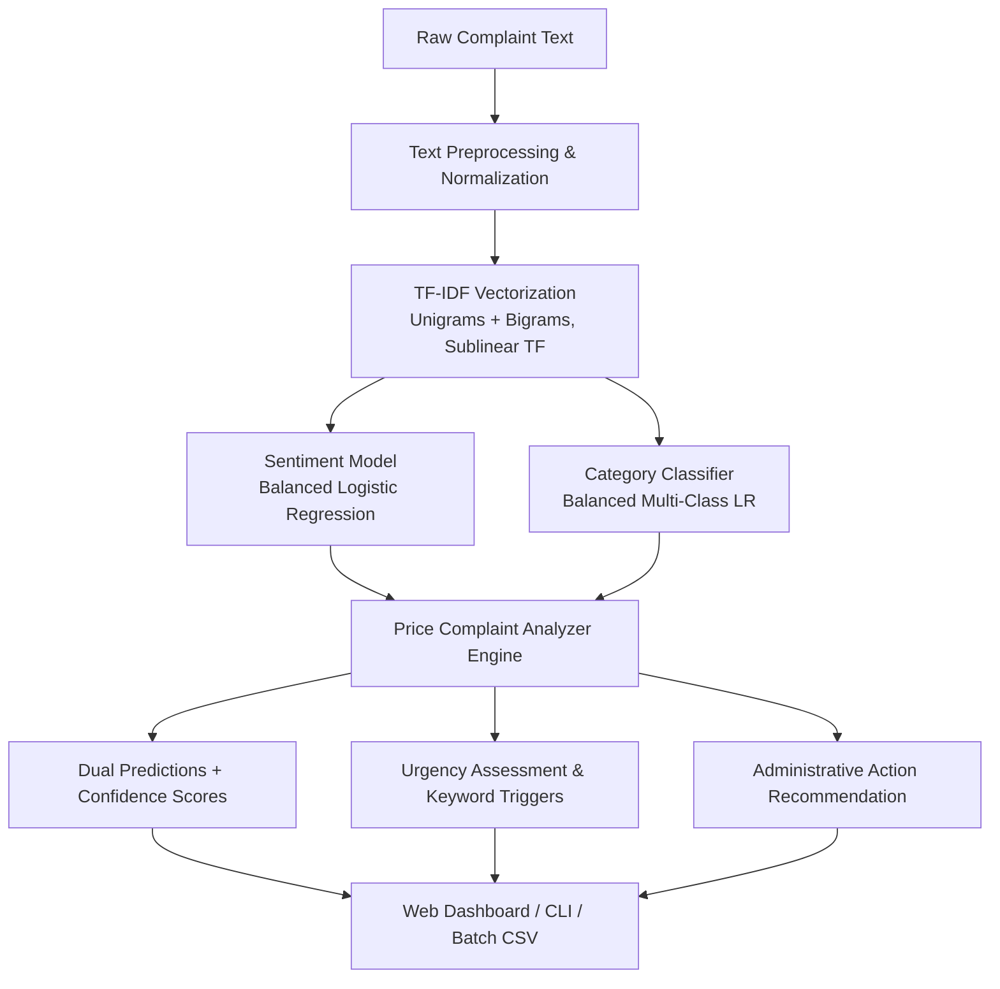

# 🏷️ NLP-Based Price Complaint Analyzer

> **An End-to-End Natural Language Processing (NLP) System for Sentiment Analysis, Pricing Categorization, and Administrative Intelligence in Campus Canteens.**

---

## 📌 1. Project Overview

In campus canteens and institutional cafeterias, student complaints regarding food prices, unfair billing, sudden price hikes, and meager portion sizes often go unaddressed or lost in unstructured feedback channels.

The **NLP-Based Price Complaint Analyzer** automates the ingestion, normalization, sentiment evaluation, and multi-class categorization of student price feedback. By connecting sentiment classification with domain-specific complaint taxonomy, the system delivers real-time priority scoring and actionable recommendations to canteen administrative committees.

---

## ✨ 2. Key Features & Capabilities

- **Unified NLP Cleaning Pipeline:** Standardizes informal campus slang (`pls` &rarr; `please`, `cant` &rarr; `cannot`), reduces elongated emotional text (`expensiveeeee` &rarr; `expensive`), and removes special characters while preserving pricing digits.
- **Dual Model Intelligence:**
  - **Sentiment Analysis:** Identifies whether feedback is **Positive** or **Negative** with high confidence. Uses class-balanced Logistic Regression to overcome dataset skew.
  - **Price Complaint Classification:** Categorizes complaints into 5 distinct operational domains.
- **Urgency Scoring:** Evaluates billing fraud/mismatch risks and assigns priority flags (**CRITICAL**, **HIGH**, **MEDIUM**, **LOW**).
- **Trigger Keyword Extraction:** Automatically detects price numbers and domain trigger words (e.g., `menu`, `billed`, `counter`, `portion`, `increase`).
- **Administrative Action Suggestions:** Provides tailored operational steps (e.g., POS terminal audits, portion standardizations).
- **Multiple Execution Modes:**
  - Single text analysis via CLI
  - Real-time interactive terminal shell
  - Batch CSV processing
  - Full end-to-end retraining pipeline
  - Premium Web Dashboard (`app.py`) with real-time probability charts

---

## 🗂️ 3. Complaint Taxonomy (5 Categories)

1. **Price Mismatch:** Discrepancy between printed/displayed menu prices and the actual amount charged at billing.
2. **Quantity-Price Concern:** Small or meager portion sizes relative to the price charged.
3. **High Price:** General perception that an item is unaffordable or overpriced.
4. **Price Increase:** Sudden price spikes or recent cost increments without notice.
5. **General Price Complaint:** General pricing dissatisfaction or positive feedback regarding value for money.

---

## 🏗️ 4. System Architecture



---

## 📊 5. Dataset & Performance Metrics

- **Raw Dataset:** `dataset/complaints.csv` (360 initial samples)
- **Processed Dataset:** `dataset/processed_complaints.csv` (340 unique deduplicated records)
- **Balanced Categories:** ~68 records per category
- **Performance:**
  - **Sentiment Analysis Accuracy:** **92.65%** (F1-Score: 0.96 Negative, 0.75 Macro Avg)
  - **Complaint Classifier Accuracy:** **79.41%** (Macro F1-Score: 0.78, Price Mismatch F1: 0.96)

Evaluation charts are automatically generated and saved to `reports/figures/`:
- `category_distribution.png`
- `word_count_distribution.png`
- `top_words.png`
- `sentiment_distribution.png`
- `sentiment_confusion_matrix.png`
- `complaint_category_distribution.png`
- `complaint_confusion_matrix.png`

---

## 📁 6. Repository Structure

```
NLP_Minor_Project/
├── app.py                      # Flask Web Dashboard & REST API
├── main.py                     # Unified CLI Orchestrator (train, analyze, batch, web)
├── requirements.txt            # Python dependencies
├── README.md                   # Comprehensive documentation
├── dataset/
│   ├── complaints.csv          # Raw labeled complaints dataset
│   └── processed_complaints.csv# Preprocessed & deduplicated dataset
├── models/
│   ├── sentiment_model.pkl      # Trained Sentiment Logistic Regression
│   ├── sentiment_vectorizer.pkl # TF-IDF Vectorizer for Sentiment
│   ├── complaint_classifier.pkl # Trained Multi-class Category Classifier
│   └── complaint_vectorizer.pkl # TF-IDF Vectorizer for Categories
├── reports/
│   └── figures/                # Auto-generated high-resolution evaluation plots
├── src/
│   ├── preprocessing.py        # EDA, Slang Normalization, and Dataset Cleaning
│   ├── sentiment_analysis.py    # Sentiment Model Training & Evaluation
│   ├── complaint_classifier.py  # Complaint Classifier Training & Evaluation
│   └── analyzer.py             # Unified Connectivity Engine & Priority Assessor
├── static/
│   └── style.css               # Modern UI Stylesheet with dark-mode theme
└── templates/
    └── index.html              # Interactive Web Interface template
```

---

## 🚀 7. Installation & Quick Start

### 1. Clone & Set Up Environment

```bash
git clone https://github.com/JaySatishPatel/NLP_Minor_Project.git
cd NLP_Minor_Project
```

### 2. Install Dependencies

```bash
pip install -r requirements.txt
```

---

## 💻 8. Usage Guide

### Mode A: Web Application (Interactive Dashboard)

Launch the modern browser dashboard:

```bash
python main.py --mode web
# OR
python app.py
```

Open your browser at `http://127.0.0.1:5000`. You can type custom complaints, click sample queries, and inspect real-time probability graphs.

---

### Mode B: Direct Single Complaint Analysis (CLI)

```bash
python main.py --mode analyze --text "The bill was 70 rupees but the menu board said 50"
```

**Output:**
```
===========================================================================
NLP PRICE COMPLAINT ANALYSIS REPORT
===========================================================================
Complaint:          "The bill was 70 rupees but the menu board said 50"
Cleaned Text:       "the bill was 70 rupees but the menu board said 50"
---------------------------------------------------------------------------
Sentiment:          [NEGATIVE] Negative (79.3% confidence)
Complaint Category: [CATEGORY] Price Mismatch (63.8% confidence)
Urgency Level:      [PRIORITY] CRITICAL (Immediate Billing Action)
Key Triggers:       [KEYWORDS] Amount/Number: 70, Amount/Number: 50, bill
---------------------------------------------------------------------------
Probabilities Breakdown:
  Sentiment: Negative: 79.3%, Positive: 20.7%
  Category:  Price Mismatch: 63.8%, High Price: 8.1%, General Price Complaint: 7.9%...
---------------------------------------------------------------------------
Management Action:
>> URGENT AUDIT REQUIRED: Inspect POS billing registers, cash counters, and verify that physical menu board prices exactly match the billed amounts.
===========================================================================
```

---

### Mode C: Real-Time Interactive Terminal Shell

```bash
python main.py --mode interactive
```

Type complaints repeatedly and receive instant evaluations without reloading models.

---

### Mode D: Batch Processing

Classify an entire CSV file of feedback at once:

```bash
python main.py --mode batch --input dataset/processed_complaints.csv --output reports/batch_predictions.csv
```

---

### Mode E: End-to-End Retraining Pipeline

Retrain all models and re-generate visual reports from scratch:

```bash
python main.py --mode train
```

---

## 🛠️ 9. Improvements Implemented in this Version

1. **Path Portability:** Replaced relative path assumptions with dynamic `PROJECT_ROOT` resolution, allowing scripts to run from any working directory.
2. **Eliminated Train-Serve Skew:** Unified text preprocessing and slang normalization into a single importable function `clean_text` shared across training and inference.
3. **Non-blocking Visualizations:** Plots are automatically saved as high-resolution PNGs in `reports/figures/` instead of halting terminal scripts with `plt.show()`.
4. **Resolved Connectivity Gap:** Created `src/analyzer.py` and `main.py`, joining the previously isolated sentiment and category classifiers into a unified pipeline with priority ranking and actionable recommendations.
5. **Modern Web Interface:** Built a responsive Flask dashboard featuring live probability bars, urgency tags, sample test triggers, and historical dataset analytics.
6. **Cross-Platform Console Compatibility:** Prevented Windows `charmap` UnicodeEncodeErrors by implementing safe terminal formatting.
