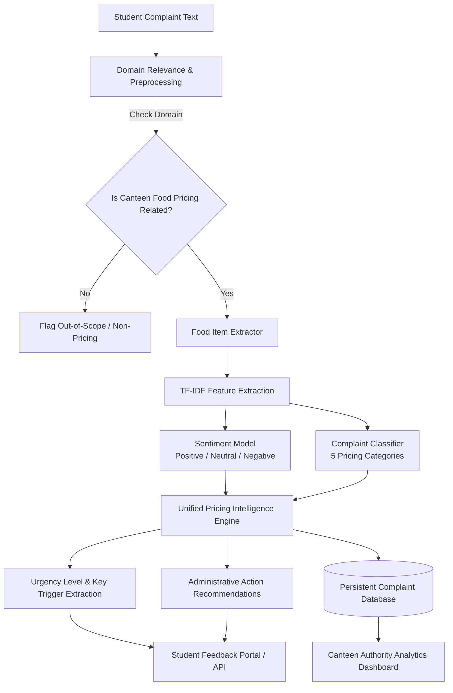

# 🏷️ College Canteen Price Complaint Analyzer

> **An End-to-End Natural Language Processing (NLP) System for Sentiment Analysis, Pricing Categorization, Food Item Tracking, and Administrative Intelligence in College Canteens.**

---

## 📌 1. Project Overview & Problem Statement

In a college canteen, students frequently purchase food items and may have concerns regarding their prices. Complaints such as *"the price of this item is too high,"* *"same item was cheaper before,"* or *"the quantity is less for this price"* are generally collected informally and are difficult to analyze systematically. Manually reviewing a large number of student complaints is time-consuming and makes it difficult for the canteen administration to identify common pricing issues.

This project implements an **NLP-based Price Complaint Analyzer** for the college canteen:
1. **Domain Relevance Verification:** Automatically identifies whether an incoming complaint is related to college canteen food pricing or is out of scope (e.g., non-food/academic grievances).
2. **Spelling & Informal Language Preprocessing:** Cleans complaint text, normalizes informal student slang (`pls` &rarr; `please`, `cant` &rarr; `cannot`, `rs` &rarr; `rupees`), and standardizes elongated words (`expensiveeee` &rarr; `expensive`).
3. **Food Item Extraction & Frequency Tracking:** Identifies the specific canteen food item involved (e.g., Samosa, Tea/Chai, Coffee, Sandwich, Dosa, Burger, Thali) and ranks which dishes receive the most complaints.
4. **5-Class Pricing Categorization:** Classifies complaints into the 5 target categories:
   - **High Price**
   - **Price Mismatch**
   - **Quantity-Price Concern**
   - **Price Increase**
   - **General Price Complaint**
5. **3-Way Sentiment Analysis:** Evaluates the overall sentiment as **Positive**, **Neutral**, or **Negative**.
6. **Persistent Storage & Administrative Summarization:** Stores all student submissions (`dataset/submitted_complaints.csv`) and aggregates summary insights for canteen authorities to prioritize audits and review menu pricing.
7. **Web Application & REST API:** An interactive dual-portal web application for both student complaint submission and canteen authority monitoring.

---

## 🏗️ 2. System Architecture



---

## 🗂️ 3. Complaint Categories & Food Taxonomy

### A. Pricing Categories
1. **High Price:** General student perception that an item is overpriced or unaffordable.
2. **Price Mismatch:** Inconsistency between the menu/display board price and the amount billed at the cash counter.
3. **Quantity-Price Concern:** Disproportionately small or meager portion size relative to the amount charged.
4. **Price Increase:** Sudden price jumps or recent cost increases without prior notification.
5. **General Price Complaint:** General pricing feedback or positive value-for-money satisfaction reviews.

### B. Tracked Canteen Food Items
`Samosa`, `Tea / Chai`, `Coffee`, `Sandwich`, `Burger`, `Dosa`, `Idli / Vada`, `Pizza`, `Noodles`, `Thali / Meal`, `Salad`, `Pastry / Bakery`, `Roll / Wrap`, `Soup`, `Beverage / Juice`, `Rice / Biryani`, `Snacks`.

---

## 📊 4. Dataset & Model Performance

- **Raw Dataset:** `dataset/complaints.csv` (360 samples)
- **Processed Dataset:** `dataset/processed_complaints.csv` (340 unique deduplicated records)
- **Active Submissions Database:** `dataset/submitted_complaints.csv`
- **Sentiment Model Accuracy:** **92.65%** (Class-balanced Logistic Regression with calibrated Positive/Neutral/Negative mapping)
- **Category Classifier Accuracy:** **79.41%** (Macro F1-Score: 0.78, Price Mismatch F1: 0.96)

Evaluation charts are automatically generated and saved to `reports/figures/`:
- `category_distribution.png`
- `word_count_distribution.png`
- `top_words.png`
- `sentiment_distribution.png`
- `sentiment_confusion_matrix.png`
- `complaint_category_distribution.png`
- `complaint_confusion_matrix.png`

---

## 📁 5. Repository Structure

```
NLP_Minor_Project/
├── app.py                      # Flask Web Application & REST API
├── main.py                     # Unified CLI Orchestrator (analyze, interactive, summary, batch, web)
├── requirements.txt            # Python dependencies
├── README.md                   # Comprehensive documentation
├── dataset/
│   ├── complaints.csv          # Raw labeled complaints dataset
│   ├── processed_complaints.csv# Cleaned & deduplicated training data
│   └── submitted_complaints.csv# Persistent record of student submissions & analytics
├── models/
│   ├── sentiment_model.pkl      # Trained Sentiment Classifier
│   ├── sentiment_vectorizer.pkl # TF-IDF Vectorizer for Sentiment
│   ├── complaint_classifier.pkl # Trained Multi-class Category Classifier
│   └── complaint_vectorizer.pkl # TF-IDF Vectorizer for Categories
├── reports/
│   ├── figures/                # Auto-generated high-resolution evaluation plots
│   └── batch_predictions.csv   # Batch analysis results
├── src/
│   ├── preprocessing.py        # EDA, Slang Normalization, and Dataset Cleaning
│   ├── sentiment_analysis.py    # Sentiment Model Training & Evaluation
│   ├── complaint_classifier.py  # Complaint Classifier Training & Evaluation
│   └── analyzer.py             # Unified Connectivity Engine & Priority Assessor
├── static/
│   └── style.css               # Modern UI Stylesheet with dark-mode theme
└── templates/
    └── index.html              # Dual-Portal Web Interface (Student + Authority)
```

---

## 🚀 6. Installation & Setup

```bash
# Clone the repository
git clone https://github.com/JaySatishPatel/NLP_Minor_Project.git
cd NLP_Minor_Project

# Install dependencies
pip install -r requirements.txt
```

---

## 💻 7. Usage Guide

### Mode A: Web Application (Student Portal & Authority Dashboard)

```bash
python main.py --mode web
# OR
python app.py
```
Open **`http://127.0.0.1:5000`** in your browser:
- **Student Portal Tab:** Enter complaints, test quick samples, and receive instant automated categorization, food item extraction, sentiment, and urgency flags.
- **Canteen Authority Dashboard Tab:** View total feedback counts, top complained food items leaderboard, breakdown of frequently reported pricing issues, sentiment split, and a searchable live table with CSV download.

---

### Mode B: Canteen Authority Summary (CLI)

```bash
python main.py --mode summary
```
**Output Preview:**
```
===========================================================================
CANTEEN ADMINISTRATION COMPLAINT INTELLIGENCE SUMMARY
===========================================================================
Total Feedback Recorded: 346

Top Food Items Receiving Complaints:
  - Thali / Meal        : 18 complaints
  - Sandwich            : 16 complaints
  - Tea / Chai          : 14 complaints
  - Burger              : 13 complaints
  - Coffee              : 10 complaints
  - Samosa              : 7 complaints

Frequently Reported Pricing Issues:
  - Price Increase           : 74 (21.4%)
  - Quantity-Price Concern   : 72 (20.8%)
  - High Price               : 71 (20.5%)
  - Price Mismatch           : 67 (19.4%)
  - General Price Complaint  : 61 (17.6%)

Sentiment Distribution:
  - Negative  : 314
  - Positive  : 30
  - Neutral   : 2
===========================================================================
```

---

### Mode C: Single Complaint Analysis (CLI)

```bash
python main.py --mode analyze --text "The samosa was 20 on the menu board but the cashier charged me 35"
```
**Output Preview:**
```
===========================================================================
NLP PRICE COMPLAINT ANALYSIS REPORT
===========================================================================
Complaint:          "The samosa was 20 on the menu board but the cashier charged me 35"
Cleaned Text:       "the samosa was 20 on the menu board but the cashier charged me 35"
---------------------------------------------------------------------------
Domain Relevance:   [YES - CANTEEN FOOD PRICING]
Identified Food:    [ITEM] Samosa
Sentiment:          [NEGATIVE] (76.1% confidence)
Complaint Category: [CATEGORY] Price Mismatch (64.8% confidence)
Urgency Level:      [PRIORITY] CRITICAL (Immediate Billing Action)
Key Triggers:       [KEYWORDS] Amount/Number: 20, Amount/Number: 35, charged
---------------------------------------------------------------------------
Management Action:
>> URGENT AUDIT REQUIRED: Inspect POS billing registers, cash counters, and verify that physical menu board prices exactly match the billed amounts.
===========================================================================
```

---

### Mode D: Real-Time Interactive Terminal Shell

```bash
python main.py --mode interactive
```

---

### Mode E: Batch Processing from CSV

```bash
python main.py --mode batch --input dataset/processed_complaints.csv --output reports/batch_predictions.csv
```

---

### Mode F: End-to-End Retraining Pipeline

```bash
python main.py --mode train
```
Runs data cleaning, slang normalization, sentiment model training, complaint classification training, and auto-saves all evaluation figures.
